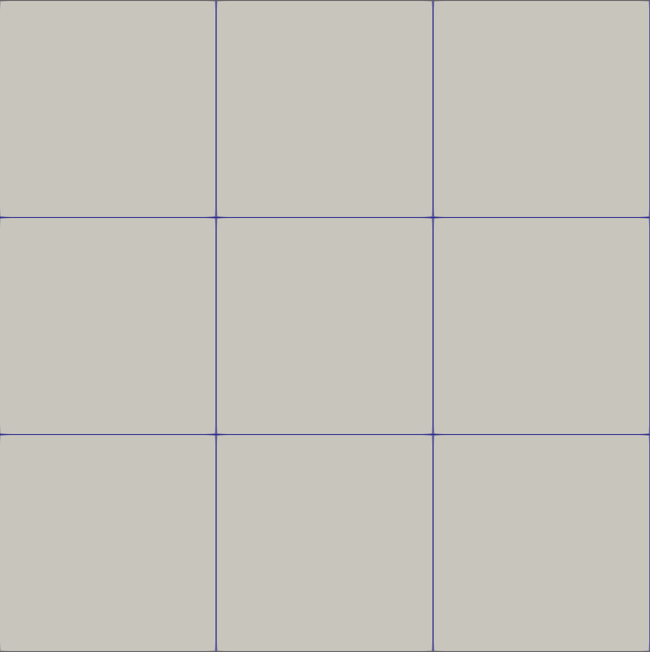
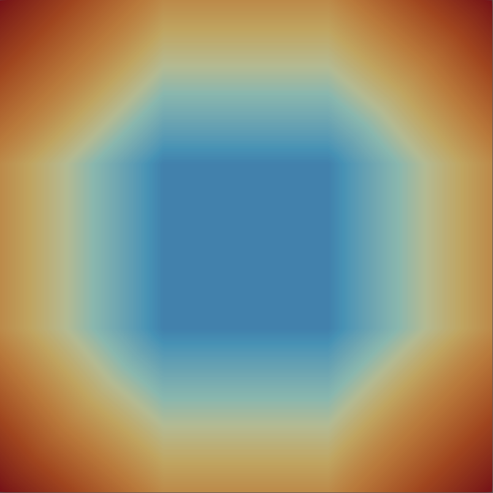
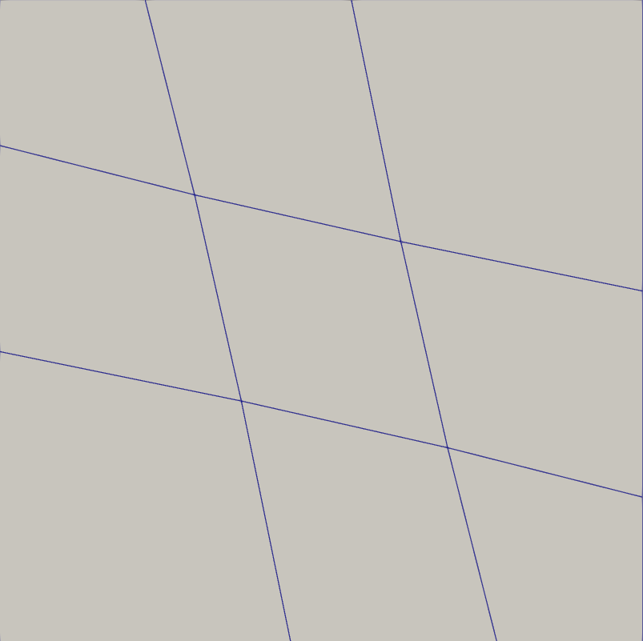
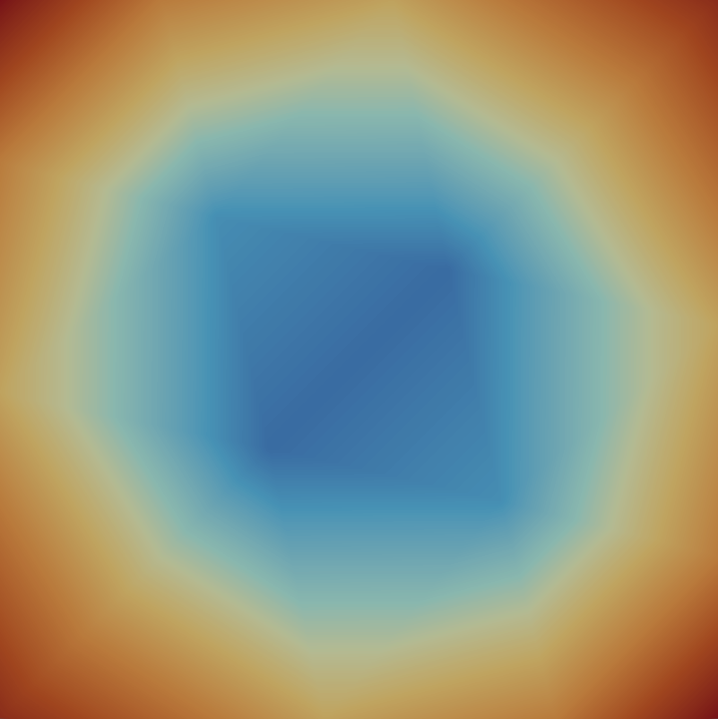
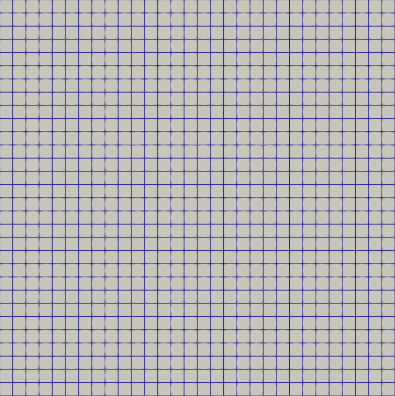
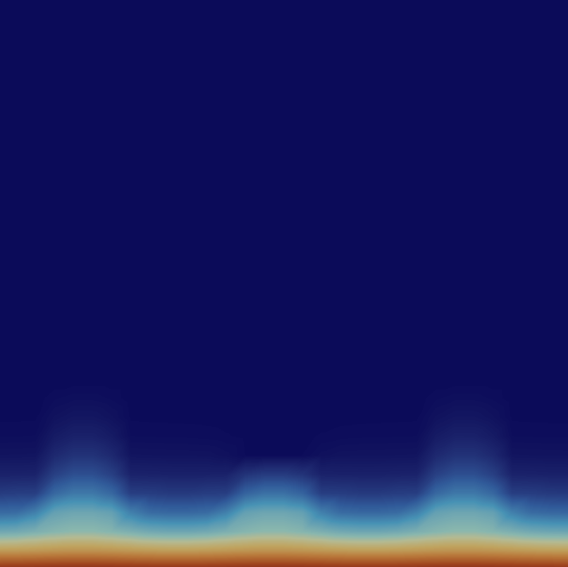
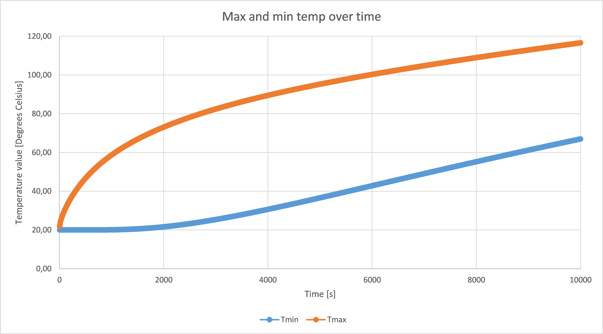
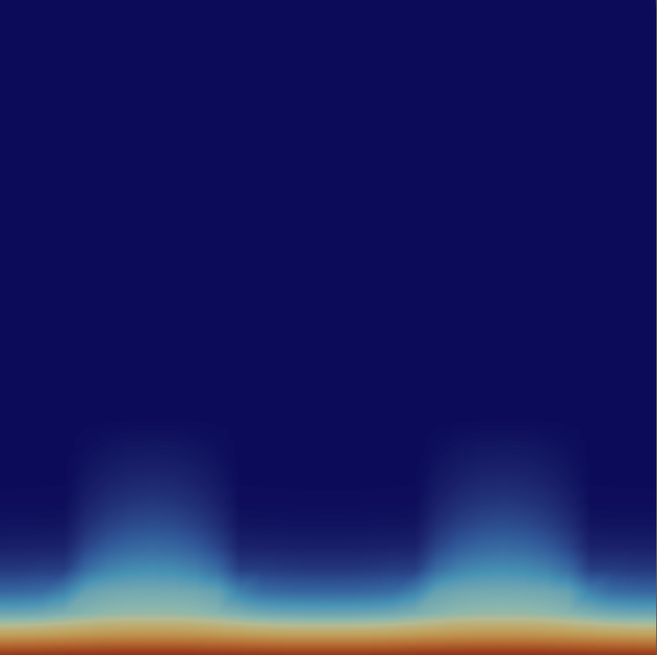
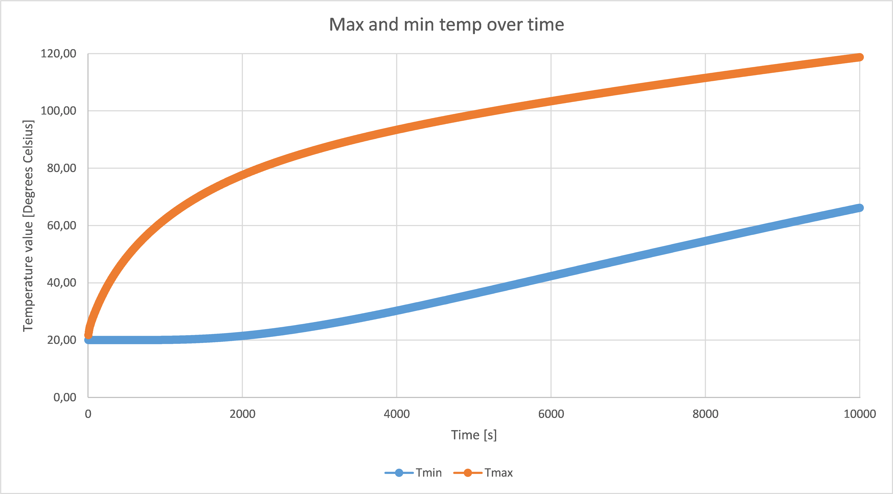
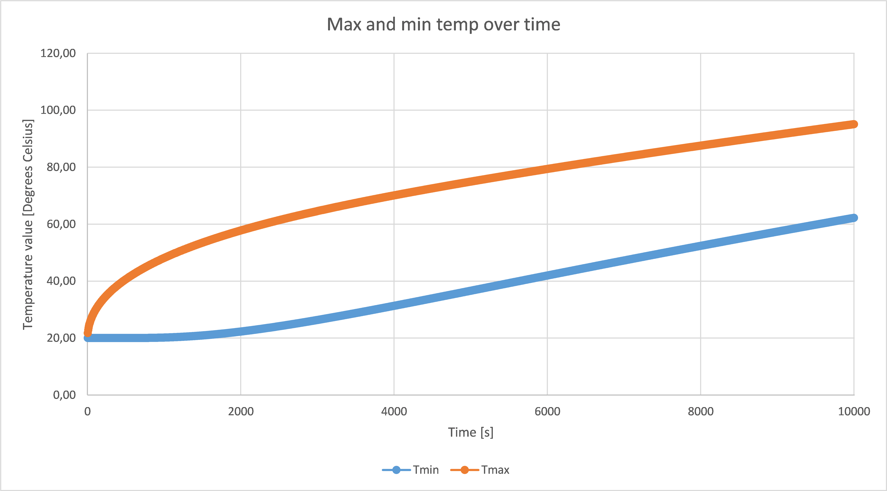

# Finite Element Method (FEM) Heat Transfer Simulation

### Numerical simulation of transient heat transfer in 2D using the Finite Element Method (FEM), including real world engineering analysis of heat propagation in different brick structures.

## Project Overview

This project implements a 2D transient heat simulation using the finite Element Method (FEM).

The solver computes temperature distribution over time by solving the following system:

$$
\left([H] + \frac{[C]}{\Delta \tau}\right) \cdot \{t_1\} - \frac{[C]}{\Delta \tau} \cdot \{t_0\} + \{P\} = 0
$$

Where the individual expressions are calculated as follows:

$$
[H] = \int_V k \left(
\frac{\partial N}{\partial x} \frac{\partial N^T}{\partial x}
+
\frac{\partial N}{\partial y} \frac{\partial N^T}{\partial y}
\right) dV
+
\int_S \alpha N N^T \, dS
$$

$$
\{P\} = - \int_S \alpha \{N\}t_\infty\, dS
$$

$$
[C] = \int_V c \rho \{N\} \{N\}^T \, dV
$$

The implementation includes:
- Custom FEM grid handling (nodes & elements)
- Numerical integration using Gauss quadrature
- Assembly of global matrices (H, C, P)
- Time-dependent simulation
- Export for visualization (ParaView)

## Why this project is interesting

Unlike typical academic implementations, this project:
- Simulates **real phisical processes** (heat transfer)
- Handles **time-dependent FEM equations**
- Implements **numerical integration (Gauss quadrature) from scratch**
- Solves **large systems of equations**
- Includes a **real engineering case study** (heat transfer in bricks with air cavities)

 

It demonstrates understanding of:
- Numerical methods
- Linear algebra in practice
- Computational physics
- Performance vs accuracy trade-offs

## Core Features

- 2D FEM grid (4-node elements)
- Transient heat transfer simulation
- Support for different materials (e.g. brick vs air)
- Configurable simulation parameters:
  - time step
  - total simulation time
  - conductivity
  - density
  - specific heat
- Boundary conditions (convection)
- Export to ParaView for visualization

## Core Structure

- `main.cpp` – simulation loop and time stepping
- `Grid.h` – core FEM logic (matrix assembly, calculations)
- `Structs.h` – data structures (nodes, elements, system)
- `GaussP.h` – Gauss-Legendre integration points
- `GaussQuad.h` – numerical integration utilities
- `FileGenerator.h` – output generation for visualization

## Example Results

### Key observations:
- Mesh density significantly affects accuracy
- Time step must be carefully chosen to avoid non-physical results
- Different mesh geometries lead to different heat distributions

 

Below is a visualization of the mesh structure (nodes and elements) used in the simulations. The corresponding temperature distributions are presented at selected time steps:
- 50 seconds for the first two meshes
- 20 seconds for the third mesh

 
Test1_4_4:

    
    

Test2_4_4_MixGrid:

    
    

Test3_31_31_Square:

    
    

 

To analyze heat propagation, the simulation results were visualized using ParaView.

## Engineering Case Study: Heat Transfer in Bricks

The project includes a real-world simulation of heat transfer in different brick structures:

- Solid brick
- Brick with small air cavities
- Brick with large air cavities

### Key findings:
- Air cavities improve insulation between surfaces
- Solid bricks heat up more slowly on the heated side
- Differences between cavity layouts are relatively small (within numerical error range)

This demonstrates how FEM can be used in **material engineering and construction analysis**.

Below are representative snapshots of temperature distribution over time for different brick configurations.

#### Small cavities (time 60, 1000, 2000 seconds):

    
    
    

    

#### Large cavities (time 60, 1000, 2000 seconds):

    
    
    

    

#### Solid (time 60, 1000, 2000 seconds):

    
    
    

    

## Technologies

- C++
- Finite Element Method (FEM)
- Numerical integration (Gauss quadrature)
- ParaView (visualization)

## Additional Resources

More information can be found in the report (Polish version):
[Report(PDF)](./MES%20-%20Sprawozdanie%20-%20Marcin%20Janiczek.pdf)

For a more detailed view of heat propagation, full simulation animations are available:
[Watch visualization videos](./Videos/)